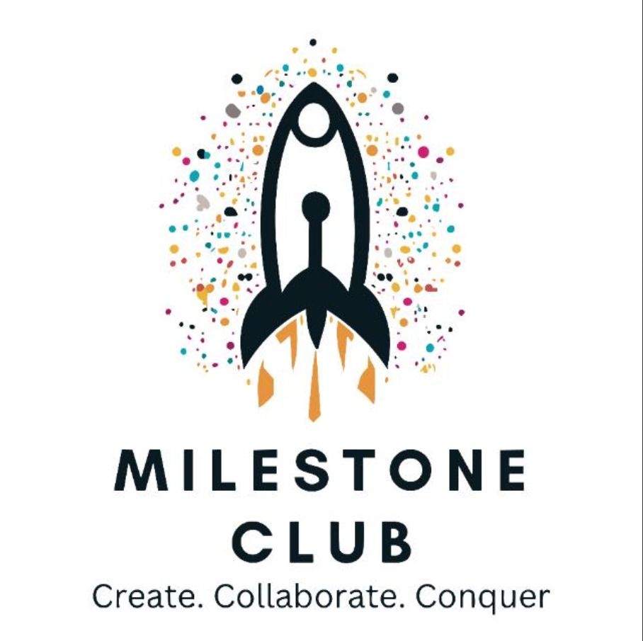

# Blogpost-Milestone
</img>
## About The Project :information_source:
The blogpost app is created to allow the students of VIT-AP to communicate online and write about whatever they want and bring a sense of community within the students.
Anyone can create an account and upload a blog to talk about whatever they want to. 

**Features**
 - A WYSIWYG editor for upload functionality of blogs and for commenting on them as well, powered by [TinyMCE](https://www.tiny.cloud/) and [CKEditor](https://ckeditor.com/)
 
 - The blogs can be sorting according to time, likes or title in both an ascending and descending manner
 
 - Users can like a blog and add a comment on the blog as well
 
 - Customizable profile page with profile picture and description that can be edited by the user

 - Password recovery system that allows the user to reset their password in case they forget it.

## Setup :gear:
 1. Clone the repository using  : 
		`git clone https://github.com/R1ssh1/Blogpost-Milestone`
 2. Open a terminal and make sure that the **Blogpost-Milestone/blogpost** directory is open
 3. On the terminal run the following command :
	 `python manage.py runserver`
	 
	 The project should now be running on localhost and it can be accessed using the link that appears in the terminal or using [this link for localhost](http://127.0.0.1:8000/)

## Main Stack
<a href="https://www.python.org/"></img></a> <a href="https://www.djangoproject.com/"></img> </a> <a href="https://www.sqlite.org/"> </img> </a> 
### Other dependencies
<a href="https://www.tiny.cloud/"> </img> </a> <a href="https://ckeditor.com/"></img><a/> <a href="https://getbootstrap.com/"> </img> </a>

## About Milestone Club, VIT AP University
The Milestone Club at VIT AP University is a student-driven organization aimed at providing a platform for students to explore and develop their skills in various technological domains. We focus on organizing collaborative projects to enhance practical knowledge and encourage innovation.

### Project Background
This project was initiated and developed by members of the Milestone Club at VIT AP University. Our club is dedicated to fostering innovation, collaboration, and learning among students interested in technology and software development.

### Project Contributors
We extend our gratitude to the contributors and members of the Milestone Club who participated in the development of this project. Their dedication and efforts have been instrumental in bringing this project to fruition.

### Follow Us on Instagram
For updates, events, and highlights from the Milestone Club, follow us on [Instagram](https://www.instagram.com/milestone_club_vitap/).

## Contribution Guidelines :page_facing_up:
Please read our Contribution Guidelines before contributing to this project.

## License :clipboard:
This project is licensed under the MIT License - see the LICENSE file for details.

